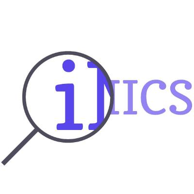

<!-- Source: https://github.com/othneildrew/Best-README-Template/pull/73 -->

<!-- PROJECT SHIELDS -->
<!--
*** I'm using markdown "reference style" links for readability.
*** Reference links are enclosed in brackets [ ] instead of parentheses ( ).
*** See the bottom of this document for the declaration of the reference variables
*** for contributors-url, forks-url, etc. This is an optional, concise syntax you may use.
*** https://www.markdownguide.org/basic-syntax/#reference-style-links
-->

<!-- PROJECT LOGO -->
 

  

  <h3 align="center">an IMICS lab project</h3>

  

    Advanced Receiver Operating Characteristic Curve Analysis to Identify Outliers in Binary Machine Learning Classifications for Precision Medicine
     
    <a href="https://arxiv.org/abs/2210.07287"><strong>Explore the docs »</strong></a>
     
     
  

<!-- TABLE OF CONTENTS -->

  
Table of Contents

  <ol>
    <li>
      <a href="#authors">Authors</a>
    </li>
    <li>
      <a href="#getting-started">Getting Started</a>
    </li>
    <li><a href="#license">License</a></li>
    <li><a href="#contact">Contact</a></li>
    <li><a href="#acknowledgments">Acknowledgments</a></li>
  </ol>

<!-- ABOUT THE PROJECT -->
## Authors

* Ernest (Khashayar) Namdar
* Farzad Khalvati

(<a href="#readme-top">back to top</a>)

### Built With

![PyTorch][pytoch]

(<a href="#readme-top">back to top</a>)

<!-- GETTING STARTED -->
## Getting Started

We have provided the source codes for IMICS ROC Analyzer software, the ROC plotting function, and the Windows installable file. Please feel free to contact us if there are any concerns.

![IMICS ROC Analyzer][IMICS_ROC_Analyzer]

<!-- LICENSE -->
## License

Distributed under the MIT License. See `LICENSE.txt` for more information.

(<a href="#readme-top">back to top</a>)

<!-- CONTACT -->
## Contacts

* Ernest Namdar - [@LinkedIn](https://www.linkedin.com/in/ernest-namdar/) - ernest.namdar@utoronto.ca
* Farzad Khalvati - [Intelligent Medical Informatics Computing Systems (IMICS) Lab](https://imics.ca/)

Project Link: [https://arxiv.org/abs/2210.07287](https://arxiv.org/abs/2210.07287)

(<a href="#readme-top">back to top</a>)

<!-- MARKDOWN LINKS & IMAGES -->
<!-- https://www.markdownguide.org/basic-syntax/#reference-style-links -->
[IMICS_ROC_Analyzer]: images/fig1.png
[pytoch]: https://img.shields.io/badge/PyTorch-EE4C2C.svg?style=for-the-badge&logo=PyTorch&logoColor=white
